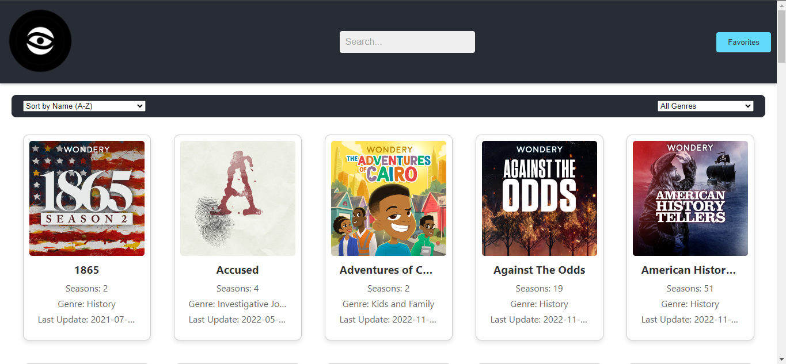
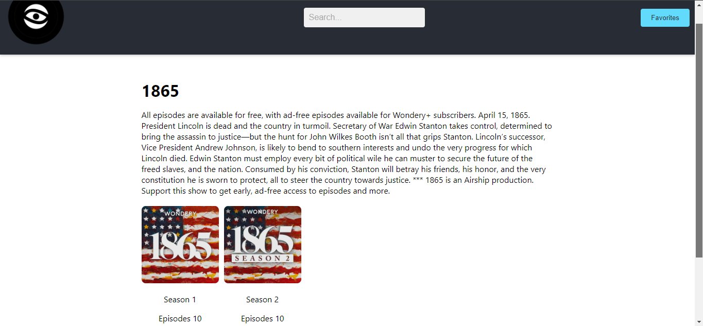
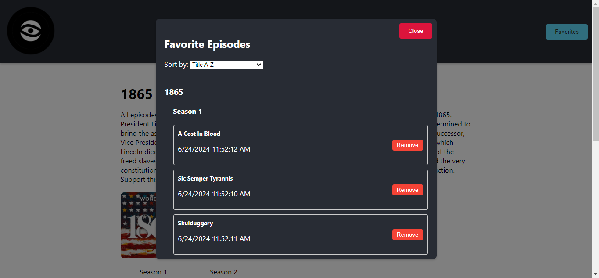

# Podcast Application

A comprehensive podcast application that allows users to browse, play, and manage their favorite podcast episodes. The application includes features such as adding episodes to favorites, playing episodes, and a responsive user interface.

[PodSphere](https://docs.google.com/presentation/d/1T9bP3VIiumeKsV0oMeQ1Yq4IaRSLS2j7vGyIpGLKLCY/edit?usp=sharing)

## Table of Contents

- [Introduction](#introduction)
- [Features](#features)
- [Screenshots](#screenshots)
- [Installation](#installation)
- [Usage](#usage)
- [Contributing](#contributing)
- [License](#license)
- [Contact](#contact)

## Introduction

The Podcast Application is a modern web app built with React. It provides an intuitive interface for users to explore various podcast episodes, add them to their favorites, and listen to them directly within the application.

## Features

- Browse a list of podcasts.
- View detailed information about each podcast, including seasons and episodes.
- Add episodes to favorites.
- Play episodes directly in the application.
- Responsive design for various screen sizes.
- Persistent favorites using localStorage.

## Screenshots

### Home Page


### Podcast Details Page


### Favorites Modal


## Installation

Follow these steps to set up the project on your local machine.

### Prerequisites

- Node.js (>=14.x)
- npm (>=6.x) or yarn (>=1.x)

### Setup

1. **Clone the repository:**
   ```sh
   git clone https://github.com/Man-Q/MAQJIY456_wf02401_GroupB_Maqoba-Jiyane_DJS11.git
   cd MAQJIY456_wf02401_GroupB_Maqoba-Jiyane_DJS11
   ```

2. **Install dependencies:**
   ```sh
   npm install
   # or
   yarn install
   ```

3. **Start the development server:**
   ```sh
   npm start
   # or
   yarn start
   ```

4. **Build for production:**
   ```sh
   npm run build
   # or
   yarn build
   ```

## Usage

### Running the Application

After setting up the project, you can run the development server using `npm start` or `yarn start`. This will open the application in your default web browser.

### Adding Episodes to Favorites

1. Browse through the list of available podcasts.
2. Click on a podcast to view its details.
3. Select a season and click on an episode to play it.
4. Use the "Add to Favorites" button to add the episode to your favorites list.

### Viewing Favorites

1. Click on the "Favorites" button in the header.
2. A modal will appear displaying your favorite episodes.
3. You can remove episodes from the favorites list or clear all favorites.

## Contributing

I welcome contributions to improve this project. To contribute, please follow these steps:

1. Fork the repository.
2. Create a new branch: `git checkout -b feature/your-feature-name`.
3. Make your changes and commit them: `git commit -m 'Add some feature'`.
4. Push to the branch: `git push origin feature/your-feature-name`.
5. Open a pull request.

## License

This project is licensed under the MIT License. See the [LICENSE](LICENSE) file for details.

## Contact

If you have any questions or feedback, please feel free to contact me:

- **Name:** Maqoba Jiyane
- **Email:** maqoba.emannuel@gmail.com
- **GitHub:** [Man-Q](https://github.com/Man-Q)

I appreciate your interest in our project and welcome your contributions!

```

### Explanation of the Sections

1. **Introduction**: A brief overview of the project, its purpose, and main features.
2. **Features**: A list of key features available in the application.
3. **Screenshots**: Visual representations of different parts of the application. Make sure the paths to your images are correct.
4. **Installation**: Detailed steps to set up the project locally, including prerequisites and setup instructions.
5. **Usage**: Instructions on how to use the application, including running the development server and using various features.
6. **Contributing**: Guidelines on how to contribute to the project.
7. **License**: Information about the project's license.
8. **Contact**: Contact information for further questions or feedback. Adjust the details to match your information.

Ensure that the image paths in the `Screenshots` section are correct and that the images exist in the specified location in your project directory. Adjust any other details specific to your project and personal information.